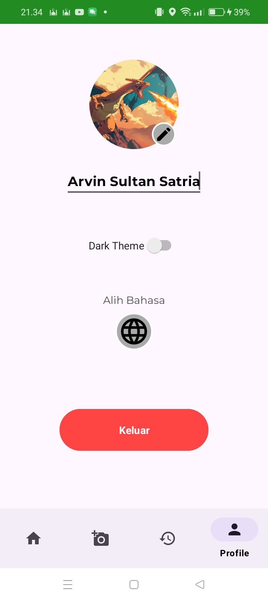

# CIFRUIT
## Automated Fruit Ripeness Detection and Classification

## Overview
CIFRUIT is an innovative solution designed to address key challenges in agriculture by leveraging machine learning and computer vision technologies to automate the detection and classification of fruit ripeness. Using advanced image recognition techniques, CIFRUIT provides accurate, efficient, and non-destructive methods for assessing fruit maturity. This application will support better harvest decisions, optimize post-harvest handling processes, reduce food waste, and improve product quality. Additionally, CIFRUIT promotes sustainable agriculture by empowering farmers, distributors, and consumers with an easy-to-use platform that enhances agricultural practices.

Inspired by the success of the Mangunan Fruit Garden in Bantul, which has become a prominent agricultural and tourism hub, our team recognizes the potential to integrate advanced technology into agriculture for improving harvest timing and product quality. Our goal is to contribute to a sustainable agricultural future through technology-driven solutions.

# Our Team
#### Team ID : C242-PS141
| No | Student ID     | Name                 | University                  | GitHub Link                       |
|----|----------------|----------------------|-----------------------------|------------------------------------|
| 1  | M179B4KX4270   | Syifa Aura Arasy    | Universitas Ahmad Dahlan    | [GitHub](https://github.com/user1)|
| 2  | M179B4KX0468   | Ammara Desma Marzooqa| Universitas Ahmad Dahlan    | [GitHub](https://github.com/user2)|
| 3  | M015B4KX2019   | Isna Septi Wahyuni  | Universitas Negeri Yogyakarta | [GitHub](https://github.com/user3)|
| 4  | C179B4KX0394   | Alifia Amalia Azzara| Universitas Ahmad Dahlan    | [GitHub](https://github.com/user4)|
| 5  | C179B4KY0465   | Amirul Mabruri      | Universitas Ahmad Dahlan    | [GitHub](https://github.com/user5)|
| 6  | A179B4KY2350   | M. Milky Gazura     | Universitas Ahmad Dahlan    | [GitHub](https://github.com/user6)|
| 7  | A179B4KY0669   | Arvin Sultan Satria | Universitas Ahmad Dahlan    | [GitHub](https://github.com/user7)|

# Project Documentation

## Mobile Development 
Aplication:

    
    
    
    
    
    
    
    
    
    

## Cloud Computing 
Cloud Computing Architecture Design

    

## Machine Learning
Machine Learning Model and Training History

Tech Stacks:

    

#How use this app?
Demo with camera:

## Project Goal
The CIFRUIT application aims to:

Automate fruit ripeness detection using machine learning and computer vision.
Optimize harvest timing and improve market readiness by providing accurate ripeness assessments.
Reduce food waste by promoting better harvesting practices and preventing the premature harvesting of fruits.
Support sustainable agriculture through the use of technology to improve post-harvest handling and product quality.
How We Came Up with This Project
Our team’s inspiration for this project stems from a shared passion for solving agricultural challenges and improving food quality. While researching agricultural processes, we discovered the difficulties farmers and consumers face in determining the optimal ripeness of fruit. We realized that an accurate ripeness detection system could not only enhance product quality but also significantly reduce food waste.

With our combined expertise in machine learning, mobile application development, and cloud computing, we brainstormed innovative ways to tackle this problem. The idea of using machine learning for fruit ripeness detection via image recognition emerged as a simple yet effective solution. This project is designed to empower farmers, distributors, and consumers by offering an easy-to-use tool for assessing fruit ripeness, thereby promoting more sustainable and efficient agricultural practices.

And of course CIFRUIT itself is open source with a [https://github.com/cifruit/CIFRUIT.git] on GitHub.

## Key Features
- Machine Learning Model: Utilizes image recognition to classify fruit ripeness levels.
- Mobile Application: A user-friendly app for farmers, distributors, and consumers to quickly assess fruit maturity.
- Cloud Integration: Leverages cloud computing to provide real-time data storage and processing capabilities.

## Technologies Used
- Machine Learning: For fruit ripeness detection and classification.For image recognition and analysis of fruit conditions.
- Mobile Development: To build an intuitive platform for end-users.
- Cloud Computing: For scalable storage and processing of data.

## Benefits
Accurate Ripeness Detection: Enhances harvest decisions, ensuring fruits are harvested at their optimal stage.
Reduced Food Waste: Prevents overripe or underripe fruits from being harvested, reducing waste in the agricultural supply chain.
Improved Product Quality: Helps in delivering better-quality produce to the market, benefiting farmers, distributors, and consumers.
Sustainability: Supports sustainable agricultural practices by optimizing harvest and post-harvest processes.

## Future Plans
Expand the Fruit Database: Increase the range of fruit types supported by the platform.
Improve AI Model Accuracy: Continuously train and refine the machine learning model for better accuracy in diverse conditions.
Partnerships with Farmers and Distributors: Collaborate with agricultural stakeholders to enhance the adoption and impact of the technology.

## Contribute
We welcome contributions to CIFRUIT! Whether you're interested in helping improve the machine learning model, enhancing the mobile application, or supporting the project in other ways, feel free to open an issue or submit a pull request.
